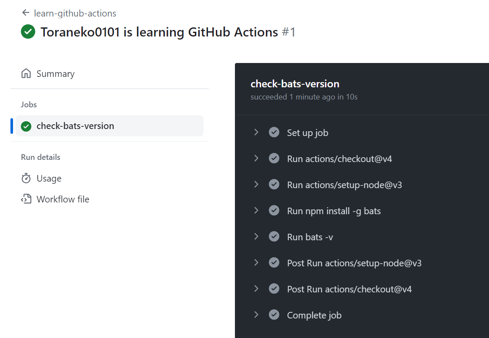

# git_practice

## 基礎
```console

# clone
git clone <repository_url>

# stage
git add <file_name>

# stage all
git add .

# commit
git commit -m "test_commit"

# stage & commit

git commit -a -m "test_commit"
```

## Push
```console

# origin -> git remote add origin <repository_URL>

# base
git push origin <local_branch>

# push先のリモートブランチを指定
git push origin <local_branch>:<remote_branch>

# リモートブランチを削除(push元がないので)
# Openなpullrequestに関連付けられているbranchは削除できない
git push origin :<remote_branch>

```

## Branch

```console

# ブランチの切り替え
git checkout <branch>

# 全てのブランチを表示
git branch -a

# ローカルブランチ一覧の表示
git branch

# リモートブランチ一覧の表示
git branch -r

# ローカルブランチの削除
git branch -D <branch>

# 上流ブランチの確認
git branch -vv

# 上流ブランチを指定(local_branchを省略すると、自動的に現在のブランチを指定する)
git branch <local_branch> -u <remote_branch> 

# リモートブランチの追跡リスト
git branch -r

# リモートブランチの追跡開始
git branch origin <branch>

# 不要になったリモートブランチを追跡しない
git fetch --prune


```

## Merge

```console

# ブランチのマージ時に、変更内容を知りたい場合、--no-ff(No-FastForward)オプションを付ける
# github上のpull-requestは--no-ffでmergeされる
# https://docs.github.com/ja/github-ae@latest/repositories/configuring-branches-and-merges-in-your-repository/configuring-pull-request-merges/about-merge-methods-on-github
git merge --no-ff
```

## ブランチの保護
```console
・settings -> branches -> add ruleで追加
・ブランチ名を入れ、有効にすると、該当ブランチには直接Push出来なくなる
・Require a pull request before merging => Mergeする前にpull-requestが必要
・Require status checks to pass before merging　=> Mergeの前にStatus Checkを通過する必要がある
```
## github cli


[マニュアル](https://cli.github.com/manual/)

```

# install
winget install --id GitHub.cli

# upgrade
winget upgrade --id GitHub.cli

# login
gh auth login

# logout
gh auth logout

# repositoryの概要(README.md)
gh repo view <repository_url>

# 新しいrepositoryを対話的に作成
gh repo create

# repositoryをclone
gh repo clone <repository_url>

# issueの確認
gh issue list

# issueを閲覧
gh issue view 4

# issueの作成
gh issue create --title "I use github-cli" --body "Nothing"

# issueにコメントを追加(4 -> #4)
gh issue comment 4 --body "I add comment"

# issueを再度開く/削除する
gh issue reopen/delete 4

# issueを閉じる
gh issue close 4 --comment "task-complete Toraneko" --reason "complete"

# pull-requestの確認
gh pr list
```

## Github-pages
```
settings/Pagesでbranchを選んで作成可能
```

## Github-release
```
・code/releaseから作成可能。
・branchを選んで、generate release notesを選ぶことで、
　pull-requestsの流れや、反映者などを設定できる
・pre-relaseを選ぶことで、表示しない風にもできる
```
## Github-issue auto close
```
Mergeする際のコメントにfix #6などと記載する
```

## Github-Codespaces
```
・緑色のcodeのボタンからCodespacesを選択する
・立ち上げる際に初期設定が必要な場合は、settingsからdotfileの設定を有効化する
・設定はsetup.sh等に記載する。
・環境設定について記載したいときは、.devcontainer/devcontainer.jsonに記載(以下では2つの拡張機能を追加している)
```

```sh
# setup.shの記載例
#!/bin/bash

sudo apt-get update
sudo apt-get install sl
sudo apt install -y fortune
```

```json
//.devcontainer/devcontainer.jsonの記載例
{
  // Name this configuration
  "name": "Codespace for Skills!",
  // Use the base codespace image
  "image": "mcr.microsoft.com/vscode/devcontainers/universal:latest",

  "remoteUser": "codespace",
  "overrideCommand": false ,
  
 // Add the IDs of extensions you want installed when the container is created.
 "customizations": {
     "vscode": {
         "extensions": [
             "ms-dotnettools.csharp",
             "ms-python.python"
         ]
     },
     "codespaces": {
         "openFiles": [
             "codespace.md"
         ]
     }
 } ,
 "postCreateCommand": "echo '# Writing code upon codespace creation!'  >> codespace.md"
}
```

## Github-Actions

### 概要
```
継続的インテグレーションと、継続的デリバリー、デプロイ(CI/CD)を実現する
    継続的インテグレーション：ビルド、テストの流れを自動化する
        Code -> Build -> Test
        テストされたコードは、一日数回Branchに統合される
    継続的デリバリー：コードに変更が生じるたびに、実稼働環境でのリリース準備を自動で行う
        Code -> Build -> Test -> Release
        変更点をReleaseする
    継続的デプロイ
        Code -> Build -> Test -> Release -> Deploy
```

### 補足
```
・何かしらのイベントをトリガーに、ワークフローを実行する
・ワークフローを実行するための仮想マシンは自分で用意することもできる
・複数のStepでJobが構成され、複数のJobでワークフローが構成される。
・Jobは順次、並列のいずれかで実行される
・ワークフローはYAMLファイルに記述する。格納位置は、.githab/workflows
・別ワークフローを参照することもできる
・複雑で繰り返されるタスクはアクションを用い、ランナーでジョブを実行する
```

### イベントについて
```
通常は、何か(たとえばissueを開いたとき)にトリガーされるが、
スケジュールに従って、自動でトリガーさせることもできる
```

### Sample
```yml
#Actionsタブに表示されるワークフローの名前。省略された場合ファイル名を表示
name: learn-github-actions 
#Actionsの実行履歴などに表示。github.actor=username
run-name: ${{ github.actor }} is learning GitHub Actions
#イベントを定義。複数の場合 on: [push, pull]
#下の例は、labelを作成したときと、main or feature/**ブランチ(ただし末尾にignoreとつくものは除く)にpushした時にトリガーする
#on:
#  labels:
#    types:
#      - created
#  push:
#    branches:
#      - main
#      - 'feature/**'
#      - '!feature/**ignore'
      
on: [push]
# workflowで実行されるすべてのJobをグループ化する
jobs:
  #jobの名前
  check-bats-version:
    #実行されるサーバ
    runs-on: ubuntu-latest
    #該当jobで実行されるすべてのstepをグループ化
    steps:
      #actions/checkoutアクションのv4を実行=リポジトリをランナーにcheckoutし、他のアクションを実行できるようにする
      #構文(別リポジトリ)は{owner}/{repository}@{ref:ブランチ名}
      #同じリポジトリならば、階層構造を相対パス等で記述
      #Marketにあるものなら構文をコピーする
      - uses: actions/checkout@v4
      #指定したバージョン(今回は14)のnode.jsをインストール -> node,npmコマンドをpathにおく
      - uses: actions/setup-node@v3
        with:
          node-version: '14'
      #run -> ランナー上でコマンドを実行。今回は、npmを用い、batのソフトウェアテストパッケージをインストール
      #スクリプトをリポジトリ内に保存している場合は、pathを書くことで実行可能(シェルタイプの記述が必要 -> shell: bash)
      - run: npm install -g bats
      #ソフトウェアのバージョンを出力
      - run: bats -v
```


### ファイルのUpload,Download
```yml
name: artifacts upload workflow

#mainブランチにpushした場合
on:
  push:
    branches: [ "main" ]


jobs:
  upload:
    #サーバ
    runs-on: ubuntu-latest
    steps:
    #必要
    - uses: actions/checkout@v2

    - run: mkdir -p path/to/artifact

    # my-artifactというキーワードでpathに該当するファイルをupload
    - run: echo hello > path/to/artifact/world.txt
    - uses: actions/upload-artifact@v3
      with:
        name: my-artifact
        path: path/to/artifact/world.txt

    # extra-artifactというキーワードでpathに該当するファイルをupload
    - run: echo hi > path/to/artifact/extra.txt
    - uses: actions/upload-artifact@v3
      with:
        name: extra-artifact
        path: path/to/artifact/extra.txt

    # extra-artifactというキーワードでpathの階層へファイルをdownload
    - uses: actions/download-artifact@v3
      id: test
      with:
        name: extra-artifact
        path: path/to/artifacts

    #downloadパスを表示
    - name: 'Echo download path'
      run: echo ${{steps.test.outputs.download-path}}

    #ファイルの中身を表示
    - name: 'Cat world.txt'
      run: cat ${{steps.test.outputs.download-path}}/extra.txt
```

## プロジェクトをDockerイメージに公開する
```console
Dockerfile: Dockerイメージの構築に必要なコマンドと手順を含む、テキストドキュメント
Dockerイメージ: 実行可能パッケージ
Dockerコンテナ: Dockerイメージのランタイムインスタンス

```

### GHCR
```control
GHCR(Github Container Registry)
    公開レジストリ。
    ここにDockerイメージをPushして、誰でもイメージをダウンロードできるようにする

    利用時
        1. Personal Access Tokenを作成する
            ※参考URL https://docs.github.com/ja/authentication/keeping-your-account-and-data-secure/managing-your-personal-access-tokens
            ※ Tokenのセキュリティはしっかりすること
        2. docker loginコマンドで、ghcr.ioに対してログインする
            docker login ghcr.io -u USERNAME
```

### コード例(Imageの取得->ログイン->Pushまで)
```yml
# 1.指定されたDockerイメージのメタデータを取得
# 2.GHCRにログインし、ビルドされたコンテナイメージをpush
# 補足：ビルドされたコンテナイメージには、取得されたshaハッシュ値のタグがつけられる
name: Publish to Docker
on:
  push:
    branches:
      - main
# アクセス許可
permissions:
  #Github Packagesでのパッケージのアップロードと公開を許可
  packages: write
jobs:
  publish:
    runs-on: ubuntu-latest
    steps:
      - name: Checkout
        uses: actions/checkout@v3

      # Dockerコンテナのメタデータを取得
      - name: Docker meta
        id: meta
        # 取得するためのアクション
        uses: docker/metadata-action@v4
        # images:対象のイメージ。
        # tags:取得したメタデータの形式(今回はshaハッシュ値->イメージの特定のビルドを識別している)
        with:
          images: ghcr.io/USERNAME/REPO/IMAGE_NAME
          tags: type=sha
    
      # Github Container Registryにログインする
      - name: Login to GHCR
        uses: docker/login-action@v2
        # registry:GHCRのレジストリURL
        # username: ActionをTriggerしたリポジトリの所有者
        # password アクセストークンを用いてGHCRにログイン
        with:
          registry: ghcr.io
          username: ${{ github.repository_owner }}
          password: ${{ secrets.GITHUB_TOKEN }}
    
      #Dockerコンテナのビルドと実行
      - name: Build container
        uses: docker/build-push-action@v4
        #context: Dockerイメージをビルドするためのコンテキスト（今回はカレント）
        #push:true ビルドしたDockerイメージをリポジトリにPushする
        #tags: Docker metaステップの出力を利用し、ビルドしたイメージにタグをつける
        with:
          context: .
          push: true
          tags: ${{ steps.meta.outputs.tags }}

```

### PushしたイメージをPull -> 実行

``` 
    imageのPull
        3. docker pull ghcr.io/USERNAME/publish-packages/game:TAG
    imageの実行
        4. docker ls
        5. docker run -dp 8080:80 --rm <YOUR_IMAGE_NAME:TAG>
        6. localhost:8080で確認
```
